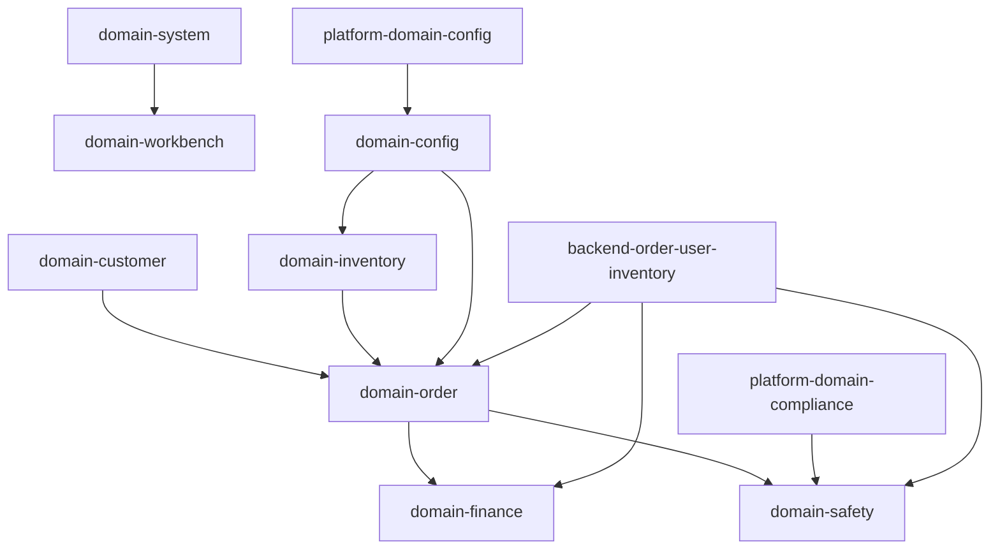

# 业务域地图

## 依赖原则
- `订单域` 是交易主线，联动客户、库存、财务、安检。
- `系统域` 提供认证、同步、消息等底座能力。
- `配置域` 提供策略参数，不直接承载交易事实。
- 平台域通过规则与监控影响配送端行为，不替代配送端主流程。

## 来源需求
- `requirements/00_全局/业务流程.md`
- `requirements/00_全局/入口对齐说明.md`
- `requirements/07_配置/*`
