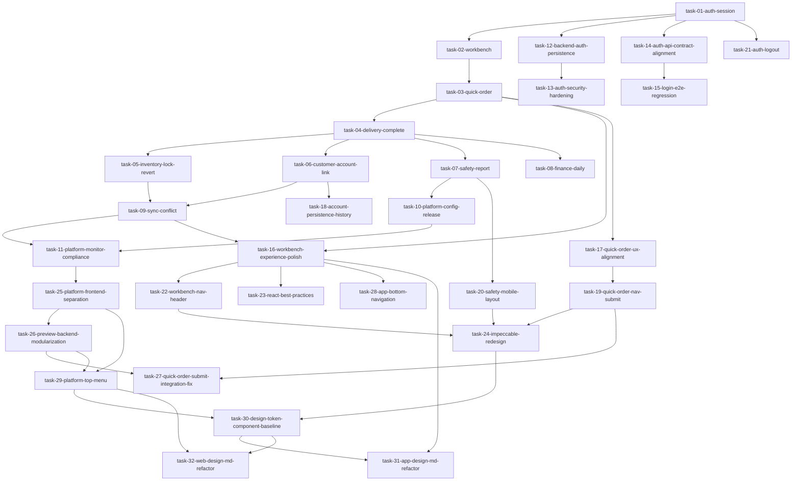

# 功能级任务拆解图

## 任务清单（按依赖顺序）
1. 登录认证与会话
2. 工作台聚合
3. 快速开单
4. 待配送到完单
5. 库存锁定与回滚
6. 客户账户联动（欠瓶/欠款）
7. 安检触发与上报
8. 财务记账与日结
9. 同步队列与冲突处理
10. 平台规则配置与发布
11. 平台监控与合规看板
12. 工作台体验优化
13. 快速开单交互与边界对齐
14. 客户账户持久化与催收历史
15. 快速开单导航与确认开单契约补齐
16. 完单安检移动端布局优化
17. 退出登录流程与会话收口
18. 工作台底部导航与头部信息层级优化
19. React 最佳实践审查与修复
20. impeccable 驱动的页面重构
21. 平台前端目录拆分与独立入口
22. 预览脚本与后端路由模块化收口
23. 快速开单提交联调修复
24. App 底部导航统一收口
25. Platform 顶部菜单统一收口
26. DESIGN.md 设计令牌与组件基线对齐
27. App 端按 DESIGN.md 的页面重构
28. Web 端按 DESIGN.md 的页面重构

